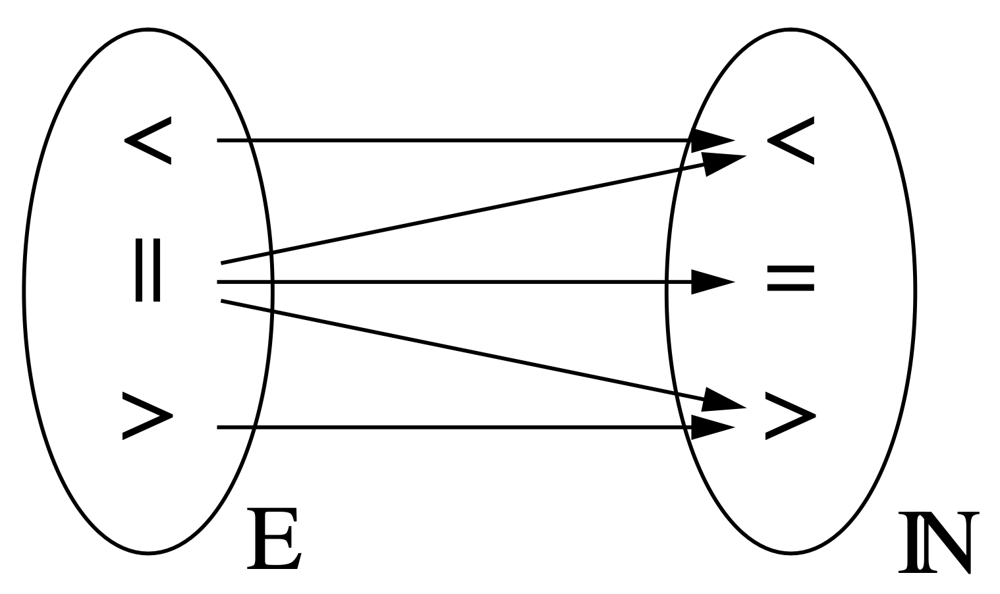

# Lamport Clocks and Vector Clocks

## Lamport clocks

A Lamport clock is a function

$$C: E \rightarrow T$$

that assigns timestamps $C(t) \in T$ to any event $e \in E$ while fulfilling the *weak clock-condition*, whose definition is based on the *happens-before* relation from above:

$$e \leq e' \rightarrow C(e) \lt C(e')$$

In his paper, Lamport proposes a mechanism that fulfills this condition. Each process is assigned a clock, with a counter value representing the current local "time". In the beginning they are all set to the same value $t_0$.

1. A process increments its counter before each local event, e. g. when sending a message
2. When a process sends a message, it includes its counter value with the message after executing step 1
3. On receiving a message, the counter of the recipient is set to the greater of its current counter value and the counter value received in the timestamp, and subsequently incremented by 1

### Shortcoming of the Lamport clock

Consider two events $e$, $e'$, that are not casually related ($e || e'$). As a result they might get assigned the same or different timestamps which can lead to three different outcomes:

- $C(e) < C(e') \rightarrow e \leq e'$
- $C(e') > C(e) \rightarrow e' \leq e$
- $C(e) = C(e) \rightarrow (e \leq e') \land (e' \leq e)$

The last statement however destroys the information about the two events *not* casually influencing each other, as it states that $e$ *might have* casually influenced $e'$ and $e'$ *might have* casually influenced $e$. This is the exact opposite of the definition of two events *not* casually influencing each other.
We can see from the figure below that the Lamport clock is a homomorphism, not an isomorphism:

In order to preserve information about two events *not* casually influencing each other, we would need a way to store the negation of the *happens-before* relation $\neg(e \leq e')$. With this, the information of two events *not* casually influencing each other could be represented by the expression

$\neg(e \leq e') \land \neg(e' \leq e)$

Vector clocks achieve this by replacing the single logical clock per thread with a vector of logical clocks (*vector clock*) per thread, with one vector entry for each thread of the program.

## Vector clocks

A vector clock is an extension of Lamport clocks. They are both logical clocks that provide a total ordering of events consistent with causality. However, vector clocks can also determine if any two events are causally dependent or concurrent.
To achieve this, each process has a vector clock that stores one value for each process's logical clock. 

Suppose we have a system of three processes: P0, P1 and P2. Each process has a vector clock that stores three values: one for each process’s logical clock. Initially, all clocks are zero: [0, 0, 0]. Whenever a process experiences an internal event (such as executing a statement), it increments its own logical clock by one. For example, if P0 executes an internal event, its vector clock becomes [1, 0, 0]. Whenever a process sends a message to another process, it attaches its current vector clock to the message. When a process receives a message from another process, it updates its vector clock by taking the maximum of each element in its own vector clock and the vector clock in the message. Then it increments its own logical clock by one. For example, if P1 sends a message with vector clock [0, 2, 0] to P2 and P2 has vector clock [1, 1 ,3], then after receiving the message P2 updates its vector clock to [1, 2, 3] (the maximum of each element) and then increments its own logical clock by one: [1, 2, 4].

A vector clock $C_1$ is less than $C_2$, $C_1 \lt C_2$, if all its elements are less or equal to the respective elements in $C_2$ ($C_1(t) \leq C_2(t) \forall t$) and at least one element is strictly smaller ($\exists t: C_1(t) \lt C_2(t)$).

The happens-before relation for vector clocks is defined based on this definition: An event a *happened-before* an event b, if the vector clock of event a $C_a$ is less then that of event b $C_b$: a happened before b $\Leftrightarrow C_a \lt C_b$.

Notably the relation $\lt$ is antisymmetric: If $C_1 \lt C_2$, then $C_2 \not\lt C_1$. This is the crucial property of vector clocks that allows them to preserve information about two events *not* casually influencing each other.

## Example

Using this algorithm, we can determine the partial ordering of events in the system and detect causality violations. For example, suppose we have these events:

- A1: P0 executes an internal event ([1, 0, 0])
- A2: P1 executes an internal event ([0, 1, 0])
- A3: P2 executes an internal event ([0, 0, 1])
- B1: P0 sends a message to P1 ([1, 0, 0])
- B2: P1 receives the message from P0 ([1, 1, 0])
- B3: P2 sends a message to P1 ([0, 0, 2])
- B4: P1 receives the message from P2 ([1, 2, 2])

We can say that $A1 \lt B4$ because A1 is causally before B4 (P0 sent a message to P1 that influenced B4). We can also say that $A3 \lt B4$ because A3 is causally before B4 (P2 sent a message to P1 that influenced B4). However, we cannot say that $A2 \lt B2$ or $B2 \gt A2$ because A2 is concurrent with B2 (there is no causal relationship between them).

### Sources

- Lamport clocks: https://lamport.azurewebsites.net/pubs/time-clocks.pdf
- Vector clocks: https://www.vs.inf.ethz.ch/publ/papers/VirtTimeGlobStates.pdf
