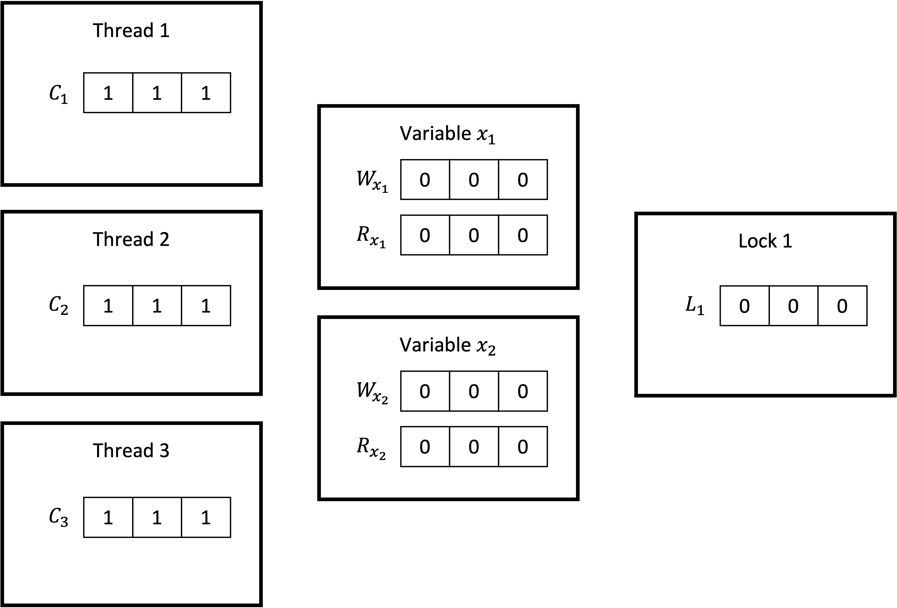

# DJIT+

The DJIT+ algorithm is a method for detecting data races in multithreaded program, that is based on the vector clocks (VC) discussed before. A

To identify data races, i.e. concurrent conflicting accesses, a *happens-before* relationship has to be established between the actions of different threads. To that end, the `DJIT+` algorithm uses vector clocks.

The algorithms maintains vector clocks for three types of objects:

- **threads** with vector clocks $C_t$
- **variables** with vector clocks $W_{x_i}$ and $R_{x_i}$ for read and write accesses respectively
- **locks** with vector clocks $L_m$

The number of elements in these vectors equals the number of threads, each element representing one thread.

## Initial values

- The vector clocks of the threads are initialized with 1 for all entries
- The vector clocks of the variables are initialized with 0 for all entries, indicating no previous access by any thread
- The vector clocks for locks start with an initial value of 0 for all entries, indicating no previous access by any thread

<!-- The image represents the initial global state maintained by the DJIT+ algorithm for three threads, two variables and one lock:

 -->

## Time frames

DJIT+ splits the program execution of each thread $t$ in *time frames*.

**A new time frame starts each time the corresponding thread performs a release operation  $rel(t, m)$ on a lock $m$.**

For a given time frame it is sufficient to

- log only the first read and write access to any given location, as any subsequent accesses *by the same thread* are ordered by program order
- check for races only between accesses to the same shared location, which are the first in their respective time frames, as they may violate the happens-before relation and therefore are potential candidates for concurrent accesses

This is the basic idea of the DJIT+ algorithm and allows to reduce the number of checks performed to detect data races.

## Updating the vector clocks

### 1. New time frame (release of a lock)

**Action**: Thread $t$ releases a lock $m$: $rel(t, m)$ (i.e. a new time frame begins for thread $t$)

**Result**:
Two updates are applied to the vector clocks:

1. The $t$'th element of the vector clock $C_t$ of thread $t$ is incremented:
    $C_t[t] \leftarrow C_t[t] + 1$.
2. The vector clock $L_m$ is set to the supremum of itself and the vector clock $C_t$ of thread $t$ (each entry of the vector clock $L_m$ of lock $m$ is updated to hold the maximum between the current value and that of $t$'s vector):

    $L_m \leftarrow sup(L_m, C_t)$

    $\Leftrightarrow$

    $\forall i: L_m[i] \leftarrow max(L_m[i], C_t[i])$

### 2. Acquiring a lock

**Action**: Thread $t$ acquires a lock $m$: $acq(t, m)$

**Result**: Vector clock $C_t$ of thread $t$ is updated so that each entry in its vector holds the maximum between its current value and that of the vector clock $L_m$:

$C_t \leftarrow sup(L_m, C_t)$

$\Leftrightarrow$

$\forall i: L_m[i] \leftarrow max(L_m[i], C_t[i])$

### 3. First read/write of a variable in a time frame

**Action**: Thread $t$ accesses variable $x_i$ the first time in the current time frame

- Read: $r(t, x_i)$
- Write: $w(t, x_i)$

**Result**:

- Read
  - $R_{x_i}[t] \leftarrow C_t[t]$
  - A read of $x_i$ is race-free if it happens after the last write of each thread. For this to be guaranteed, the write has to be protected by a lock. Therefore, if another thread $u$ released a lock before writing to a variable $x_i$, it's a possible data race. 
  
    As a thread $t$ releasing a lock $m$ causes the the vector clocks of the lock to be updated with $C_t$, and thread $u$ acquiring a lock $m$ causes $C_u$ to be joined with the vector clock of the lock, this establishes a happens-before relation between the read/write operation between different threads. Therefore the algorithm checks the condition
  
    $W_{x_i}[u] \geq C_u[u]$
    
    **If this condition is true, it reports a possible data race**, as it means that thread $u$ wrote to $x_i$ *after* releasing its last lock.
    
- Write
  - $W_{x_i}[t] \leftarrow C_t[t]$
  - The algorithm checks whether there was a thread $u$ that released a lock before reading or writing to variable $x_i$. Per the same argument as above, it checks the whether the conditions

    $W_{x_i}[u] \geq C_u[u]$

    or 

    $R_{x_i}[u] \geq C_u[u]$

    are true for another thread $u$.

    **If so, report a data race.**

## Example

Let’s consider a program with two threads, T1 and T2, that access two shared memory locations, x and y. The program is as follows:

```cpp
#include <iostream>
#include <thread>
#include <mutex>

std::mutex m;
int x = 0;
int y = 0;
int z = 0;

void T1() {
    m.lock();
    x = 1;
    m.unlock();
    y = 2;
}

void T2() {
    z = x + y;
    m.lock();
    m.unlock();
}

int main() {
    std::thread t1(T1);
    std::thread t2(T2);
    
    t1.join();
    t2.join();

    std::cout << "z: " << z << std::endl;

    return 0;
}
```

- Each thread has its own vector clock, $C_{T_1}$ and $C_{T_2}$, which are both initialized to [1, 1].
- The variables/memory locations x and y also have vector clocks $R_x$, $R_y$, $R_z$, $W_x$, $W_y$, $W_z$ which are initialized to [0, 0].

The algorithm will perform the following steps:

1. $T_1$ acquires lock m. As the locks vector clock has the value $[0, 0]$, the vector clock of $T_1$ stays at the value $[0, 0]$.
2. $T_1$ writes to x. This is the first write access to x in this time frame. The algorithm logs this access and updates $W_x$ to $[1, 0]$, indicating a write access of $T_1$ in its first time frame.
3. $T_1$ releases lock m. This is an event that updates its vector clock to $[2, 1]$. A new time frame for thread $T_1$ begins.
4. $T_1$ writes to y. This is the first write access to y in this time frame. The algorithm logs this access and updates $W_x$ to $[2, 0]$, indicating a write of $T_2$ in its second time frame.
5. $T_2$ reads from x. This is the first read access to x in the current time frame of $T_2$. Two things happen:
    - The algorithm logs this access by updating $R_x[T_2] \leftarrow C_{T_2}[T_2] = 1$.
    - The algorithm checks whether thread $T_1$ released a lock before writing to $x$. As $W_{x}[T_1] = 1 \lt C_{T_1}[T_1] = 2$, this is not the case. Hence, no data race is reported.
6. $T_2$ reads from y. This is the first read access to y in the current time frame of $T_2$. Two things happen:
    - The algorithm logs this access by updating $R_y[T_2] \leftarrow C_{T_2}[T_2] = 1$.
    - The algorithm checks whether thread $T_1$ released a lock before writing to $<$. As $W_{<}[T_1] = 2 \geq C_{T_1}[T_1] = 2$, this is the case. 
    
      **Therefore a data race is reported.**
7. $T_2$ acquires lock m. This is an event that updates its vector clock to [2, 1].
8. $T_2$ releases lock m. This is an event that updates its vector clock to [2, 2].
9. ...

## Sources
- [Efficient On-the-Fly Data Race Detection in Multithreaded C++ Programs](https://www.researchgate.net/publication)